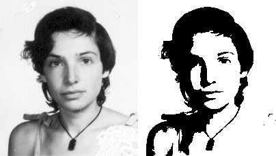

# project-chasm

## Description
This code takes a path to a directory and performs Otsu Thresholding on each compatible image and writes seperately for each image the results, as well as an image with the two images next to each other (original, Thresholded) for comparison.

## Requirements
- Working C++ compiler (C++ 17 or greater)
- CMake (version >= 2.8)
- OpenCV (version >= 4.0.0)

## Usage
- `./getThreshold <path to directory containing the images> <output file prefix>`

## Example Results

## How to build
### Linux or MacOS
- Build project
  - create and navigate into a new directory in the cloned project directory: `mkdir build && cd build`
  - execute the following commands: `cmake ..` and `make`
- Run executable
  - to run the executable, execute the following: `./getThreshold <path to directory containing the images> <output file prefix>`
    - ex. command: `./getThreshold ../2_otsu test`
    
### Windows
- ***add the binary directory of OpenCV to System (or User) PATH variable***
  - ex. path: `C:\OpenCV-4.5.3\opencv\build\x64\vc15\bin`
- Build project
  - create and navigate into a new directory in the cloned project directory: `mkdir build && cd build`
  - execute the following command: `cmake -DOpenCV_DIR=<path to 'build' directory of OpenCV> ..`
    - ex. path: `C:\OpenCV-4.5.3\opencv\build`
  - open the build folder of the project and open the *.sln* Visual Studio file
  - change the startup project to *getThreshold* by right clicking on *getThreshold* in the Solution Explorer and selecting *Set as StartUp Project*
  - run code by clicking on the green arrow or pressing F5
- Run executable
  - open Command Prompt (or PowerShell) and navigate to the project build folder, then: `cd Debug`
  - in Debug, run the following command: `getThreshold.exe <path to directory containing the images> <output file prefix>`
    - ex. command: `getThreshold.exe ../2_otsu test`
